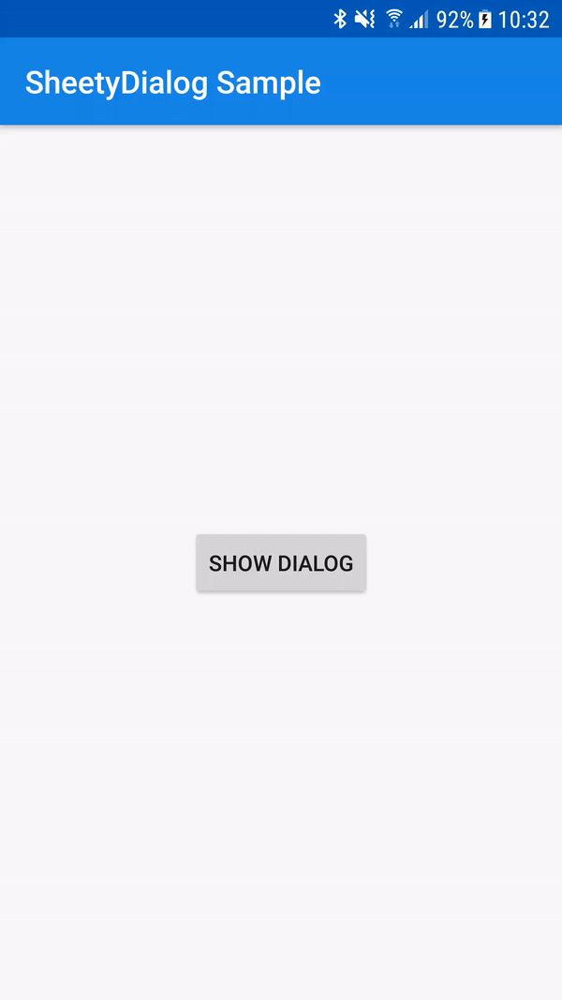

# SheetyDialog
SheetyDialog is simple DialogFragment implementation for almost full-screen dialog sliding from bottom and looking like BottomSheet.

I wasn't happy with BottomSheet behaviour and how tricky it was to make it to expand. Other option it was to change window animation for DialogFragment but I noticed there was a `statusBarBackground` element which was animating along with my dialog, so sliding animation looked half-baked. That's why I decided to make this simple library.

## Presentation


          
## Usage

In order to use SheetyDialog you should create a custom class which inherits from SheetyDialog. Then create a layout for your content and simple inflate it along with main layout:

```kotlin
class YourSheetyDialog : SheetyDialog() {

    override fun onCreateView(
        inflater: LayoutInflater,
        container: ViewGroup?,
        savedInstanceState: Bundle?
    ): View? {
        val view = super.onCreateView(inflater, container, savedInstanceState)
        inflater.inflate(R.layout.your_content_layout, view?.findViewById(R.id.contentContainer), true)
        return view
    }
    
}
```

Now you're set and you cant implement the rest of your view logic :)

## Customisation

For now, there're only 3 parameters which you can override:
1. `cornerRadius` - determines how much rounded top corners suppose to be,
2. `dialogTopFreeSpace` - determines how much space should be left at the top. `0dp` means that dialog will be fullscreen,
3. `backgroundDimAmount` - determines how dark the background suppose to be. `1.0` means background will be completely black.

In order to override them, simply put these values in your `dimens` file.

## License

Copyright 2020 Łukasz Kiełczykowski

Licensed under the Apache License, Version 2.0 (the "License"); you may not use this file except in compliance with the License. You may obtain a copy of the License at

```
http://www.apache.org/licenses/LICENSE-2.0
```

Unless required by applicable law or agreed to in writing, software distributed under the License is distributed on an "AS IS" BASIS, WITHOUT WARRANTIES OR CONDITIONS OF ANY KIND, either express or implied. See the License for the specific language governing permissions and limitations under the License.
